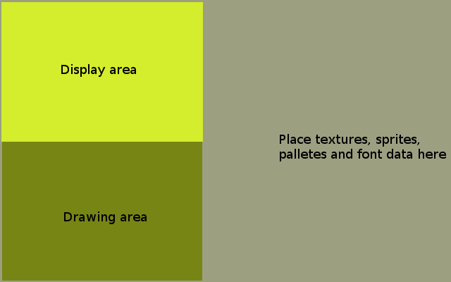

= PSXSDK User Guide

:toc:

== Introduction

=== About
This document is reference for PSXSDK - softawre development toolkit
for creating games and applications for Playstation 1 game
console. PSXSDK is developed by <nextvolume> since 2008. You can find
it here: http://code.google.com/p/psxsdk .

IMPORTANT: PSXSDK has not to be confused with Psy-Q, the official,
closed-source Software Development Kit made by Sony much earlier. Both
are meant to do the same thing, but they use different tools and
techniques to achieve their goal.

=== What's included?
PSXSDK mainly divided in four parts: libraries, compilers, converters
and CD-ROM tools.

.Libraries
Programming with plain C, sending data directly into PSX I/O ports is
a bit difficult. So the most common tasks are wrapped in functions,
which allow you to concentrate on game development.

.Compilers
They are used to create an executable file from a code written in a
certain programming language (C in our case). PSXSDK, for example,
uses psx-gcc, a modified version of GCC for the MIPS R3000 processor,
the one used in PSX. psx-gcc outputs an ELF format file (ELF stands
for Executable and Format File).

.File converters
computers and game systems don't use the same file formats, so tools
are needed to convert them. For example, the aforesaid ELF file should
be converted to the PSX executable format using elf2exe. Some of these
tools are wag2vag, bmp2tim, mod4psx, psfex, etcetera

.CD-ROM utilities
this kind of applications are used to create licensed ready-to-burn
images of the game. The process consists of creating a .ISO image with
mkisofs and, afterwards, mkpsxiso to create the needed .BIN/.CUE
files. Lastly, any CD-ROM burner software will allow us to play our
game on real hardware.

.Other tools
PSXSDK also includes some more tools for various uses, such as huff
(Huffman compressor), systemcnf, exefixup...  Some tools will be added
later depending on new features added to PSXSDK.

=== Community

You can meet other people, interested in PSX game development here:

- Irc channel: #unhaut on irc.freenode.net
- Forums: http://unhaut.fav.cc/forums

== PSXSDK setup

[[anchor-3]]
== Overview of PSX hardware

=== Common limitations for programming

If you just want to know how much you will be limited in creation of
your games, there is a short list of hardware limitations:

  - RAM - 2 Mb (in fact 1,5 Mb, because game exe file uses memory too)
  - CPU speed - 33 Mhz
  - Video Ram - 1 Mb
  - possible screen resolutions:
    ** 256 × 224
    ** 320 x 240
    ** 640 x 480
  - Audio memory - 512 Kb
  - CD-ROM read speed - 300 kB/s
  - Memory card capacity - 128 kB

.File system limitation
The PSX uses the standard CDROM ISO9660 filesystem without any
encryption (ie. you can put an original PSX CDROM into a DOS/Windows
computer, and view the content of the files in text or hex editors
without problems). But when you creating your own CDROM media, you
must remeber, that only 8.3 filenames are supported. That means, 8
letters for filename and 3 letters for file extension.

=== Video RAM reference
Maybe one of the most important things when you talk about game
programming. VRAM in PSX can be imagines as canvas with size 1024 x
512 pixels. This is two-dimensional address space composed of 16-bit
pixels. The top left pixel has the coordinates (0, 0) and the bottom
right pixel has the coordinates (1023, 511). Each pixel is made up of
three 5-bit data items indicating RGB brightness values, each ranging
from 0~31, and a semi-transparency flag. The semi-transparency flag is
only valid when the pixel is used as a texture.

==== Display area and drawing area
Many time per second PSX scan its VRAM and displays it content on your
TV screen. You can specify a rectangular area, which must be
translated on screen. This area must have size same as one of
supported screen resolutions. In this area you can draw lines,
polygons, sprites - everything you want user to see during gameplay.

This is display area. You can use just it, but there is a problem -
PSX sends picture to TV few times per second, and if you will not
finish all drawing untill another sending will be started, the
uncomplete picture will be sended on TV. And user will see blinking
image.

To prevent it you must use another area - drawing area, where you will
draw everything, but which will not be sent on TV. When you end
drawing you can switch drawing area to display area. And the display
area will become drawing area. And this must be repeated every
redrawing cycle. Sounds difficult, but most time you will not think
about it, using simple code snippet.

The common state of VRAM is on this diagram.

=== CD-ROM

Just usual CDROM, you must not worry about its speed or buffer size or
so. But there is some features, related to this device.

==== Real Time Streaming
With the above Interleave, files can be played continously at real time - that,
unless read-errors do occur. In that case the drive controller would usually
perform time-consuming error-correction and/or read-retries. For video/audio
streaming the resulting delay would be tendencially more annoying as than
processing or skipping the incorrect data.
In such cases the drive controller is allowed to ignore read errors; that
probably on sectors that have the Real Time (RT) flag set in their subheaders.
The controller is probably doing some read-ahead buffering (so, if it has
buffered enough data, then it may still perform read retries and/or error
correction, as long as it doesn't affect real time playback).
For great sadness streaming now is unsupported in PSXSDK.

== Programming with PSXSDK

=== Commom principles

We hope, that you had a look into section <<anchor-3,Overview of
  Playstation 1 hardware>>, so principles of programming described
  below will be clear.  The main idea is to initialize PSXSDK libs and
  launch infinite loop. During this loop you must do game logic, like
  moving enemies or detecting collisions, read user input, redraw
  screen.

The best way to got into soething is to see example how to do it, right?

==== Hello World example

[source,c]
--------------------------------------------------
#include <psx.h>
#include <stdio.h>

unsigned int prim_list[0x4000];
volatile int display_is_old = 1;
volatile int time_counter = 0;
int  dbuf=0;

void prog_vblank_handler() {
    display_is_old = 1;
    time_counter++;
}

int main() {
    /* Basic initialization, you will need it in every game */
    PSX_Init();
    GsInit();
    GsSetList(prim_list);
    GsClearMem();

    /* Here you set screen resolution of your game and video mode */
    GsSetVideoMode(320, 240, VMODE_PAL);

    /* you need to load font if you want to use GsPrintFont function */
    GsLoadFont(768, 0, 768, 256);

    /* 
       set a function which will be called every time image will be
       sent to TV 
    */
    SetVBlankHandler(prog_vblank_handler);

    /* Infinite loop of your game */
    while(1) {

        /* here we check if image was sent to TV */
        /* if sent - we start drawing again */
        if(display_is_old)  {
            /* changing flag of
            dbuf=!dbuf;

            /* here we switch drawing area and display area */
            GsSetDispEnvSimple(0, dbuf ? 0 : 256);
            GsSetDrawEnvSimple(0, dbuf ? 256 : 0, 320, 240);

            /* clear drawing area */
            GsSortCls(0,0,0);

            /* print the text on the drawing area */
            GsPrintFont(70, 120, "Hello world from PSX");

            GsDrawList();
            while(GsIsDrawing());

            /* set flag to prevent redrawing until drawed picture will be sent on TV */
            display_is_old=0;
        }
    }

    return 0;
}
--------------------------------------------------

==== Handling input

After your output something on TV screen, the second question is - how
to handle user's input? The most common device used almost in every
PSX game is a gamepad. For now it will be enough.

The main idea here, that you can check state of any gamepad key when
you need it. There is no interruption handling or so. Let's see an
example.

[source,c]
--------------------------------------------------
#include <psx.h>
#include <stdio.h>

unsigned int prim_list[0x4000];

/* here we will save gamepad state */
unsigned short padbuf;

volatile int display_is_old = 1;
volatile int time_counter = 0;
int  dbuf=0;

int hx=0, hy=0;

void prog_vblank_handler() {
    display_is_old = 1;
    time_counter++;
}

int main() {
    PSX_Init();
    GsInit();
    GsSetList(prim_list);
    GsClearMem();
    GsSetVideoMode(320, 240, VMODE_PAL);
    GsLoadFont(768, 0, 768, 256);
    SetVBlankHandler(prog_vblank_handler);

    while(1) {
        if(display_is_old)  {
            dbuf=!dbuf;
            GsSetDispEnvSimple(0, dbuf ? 0 : 256);
            GsSetDrawEnvSimple(0, dbuf ? 256 : 0, 320, 240);

            GsSortCls(0,0,0);

            /* get the gamepad state */
            PSX_ReadPad(&padbuf, NULL);

            
            /* change coords according to which gamepad button was pressed */
            if(padbuf & PAD_LEFT)  hx--;
            if(padbuf & PAD_RIGHT) hx++;
            if(padbuf & PAD_UP)    hy--;
            if(padbuf & PAD_DOWN)  hy++;

            /* display text with changes coords */
            GsPrintFont(hx, hy, "Hello world from PSX");

            GsDrawList();
            while(GsIsDrawing());

            display_is_old=0;
        }
    }

    return 0;
}
--------------------------------------------------

Not very difficult, right? Now here is full list of possible gamepad buttons constants:

[options="header"]
|==================================== 
| Constant     | Gamepad key          
| PAD_LEFT     | Direction pad left   
| PAD_RIGHT    | Direction pad right  
| PAD_UP       | Direction pad up     
| PAD_DOWN     | Direction pad down   
| PAD_L2       | L2                   
| PAD_R2       | R2                   
| PAD_L1       | L1                   
| PAD_R1       | R1                   
| PAD_TRIANGLE | Triangle             
| PAD_CIRCLE   | Circle               
| PAD_CROSS    | Cross                
| PAD_SQUARE   | Square               
| PAD_SELECT   | Select               
| PAD_START    | Start                
|==================================== 

== Caveats
